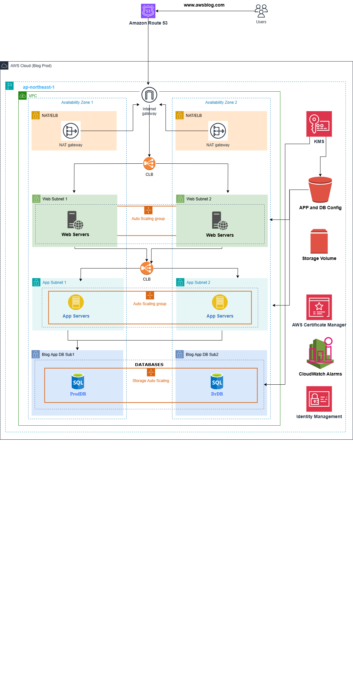

# 👨🏼‍💻Deploying a 3 Tier AwsBlog Web Application on AWS👨🏼‍💻
<html>
  <body>
    
    
  This project implements a high-availability WordPress deployment using a 3-tier architecture on AWS. It leverages Amazon EC2 instances for the Web and App tiers, and Amazon RDS for the MySQL database layer. The deployment follows best practices for scalability, separation of concerns, and fault tolerance.

  </body>
</html>

# STEP 1: Create The Base Networking Infrastructure For NAT/ELB, Webservers, Appservers and Database
 ## A) Create The VPC Network
   * Name: Prod-VPC
   * CidirBlock: 10.0.0.0/16
