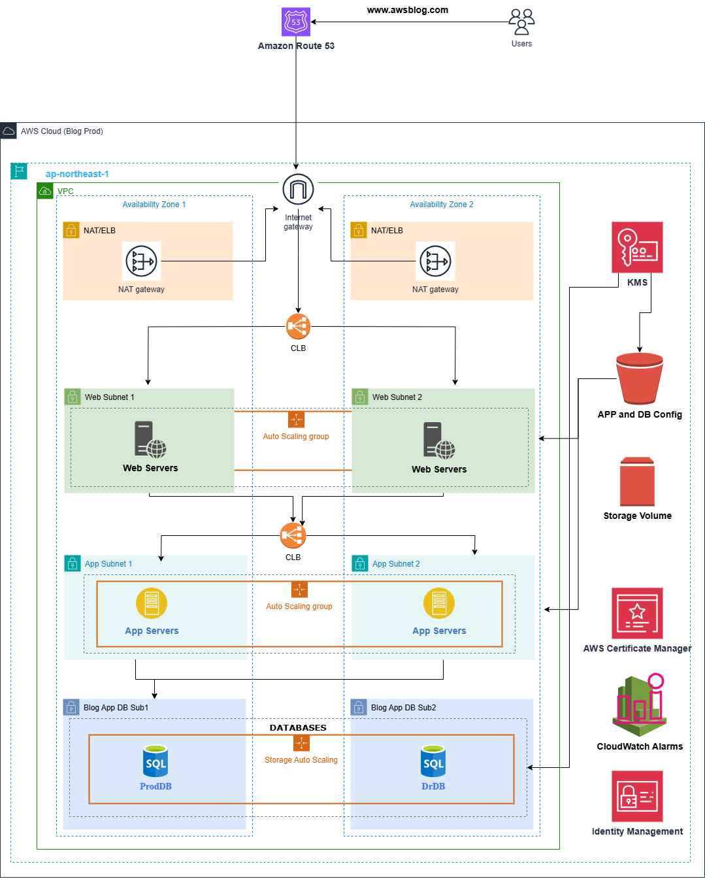

# 👨🏼‍💻Deploying a 3 Tier AwsBlog Web Application on AWS👨🏼‍💻
<html>
  <body>
    
    
  This project implements a high-availability WordPress deployment using a 3-tier architecture on AWS. It leverages Amazon EC2 instances for the Web and App tiers, and Amazon RDS for the MySQL database layer. The deployment follows best practices for scalability, separation of concerns, and fault tolerance.

  </body>
</html>

# STEP 1: Create The Base Networking Infrastructure For NAT/ELB, Webservers, Appservers and Database
 ## A) Create The VPC Network
   * Name: Prod-VPC
   * CidirBlock: 10.0.0.0/16
##  B) Create The NAT/ELB Subnet 1 and 2
    1)NAT/ALB Subnet 1
     * Name: Prod-NAT-CLB-Subnet-1
     * CidirBlock: 10.0.5.0/28
     * Availability Zone: ap-northeast-1a
    2)NAT/ALB Subnet 2
     * Name: Prod-NAT-CLB-Subnet-2
     * CidirBlock: 10.0.10.0/28
     * Availability Zone: ap-northeast-1b
 ## c) Create The Webserver Subnet 1 and 2
    1)Webserver Subnet 1
     * Name: Prod-Webserver-Subnet-1
     * CidirBlock: 10.0.15.0
     * Availability Zone: ap-northeast-1a
    2)Webserver Subnet 2
     * Name: Prod-Webserver-Subnet-2
     * CidirBlock: 10.0.20.0
     * Availability Zone: ap-northeast-1b
 ## D) Create The Appserver Subnet 1 and 2
    1)Appserver Subnet 1
     * Name: Prod-Appserver-Subnet-1
     * CidirBlock: 10.0.25.0
     * Availability Zone: ap-northeast-1a
    2)Appserver Subnet 2
     * Name: Dr-Appserver-Subnet-2
     * CidirBlock: 10.0.30.0
     * Availability Zone: ap-northeast-1b
## F) Create The Database Subnet 1 and 2
    1)Database Subnet 1
     * Name: Prod-db-Subnet-1
     * CidirBlock: 10.0.35.0
     * Availability Zone: ap-northeast-1a
    2)Database Subnet 2
     * Name: Dr-db-Subnet-2
     * CidirBlock: 10.0.40.0
     * Availability Zone: ap-northeast-1b  

# STEP 2: Create 4 Public Route Rable and 4 Private Route Tables (Because of NAT Redundancy Implementation)
  ## A) NAT/ALB Public Subnet 1 Route Table
      * Name: Prod-NAT-CLB-Public-RT-1
      * VPC: Select the Prod-VPC
  ## B) NAT/ALB Public Subnet 2 Route Table
      * Name: Dr-NAT-CLB-Public-RT-2
      * VPC: Select the Prod-VPC
  ## C) Webserver Subnet 1 Route Table
      * Name: Prod-Webserver-RT-1
      * VPC: Select the Prod-VPC
  ## D) Webserver Subnet 2 Route Table
      * Name: Dr-Webserver-RT-2
      * VPC: Select the Prod-VPC
  ## E) Appserver Subnet 1 Table Table
      * Name: Prod-Appserver-RT-1
      * VPC: Select the Prod-VPC
  ## F) Appserver Subnet 2 Table Table
      * Name: Dr-Appserver-RT-2
      * VPC: Select the Prod-VPC
  ## G) Database Subnet 1 Route Table
      * Name: Prod-Database-RT-1
      * VPC: Select the Prod-VPC
  ## H) Database Subnet 2 Route Table
      * Name: Dr-Database-RT-2
      * VPC: Select the Prod-VPC
# STEP 3: Associate All Above Route Tables With Their Respective Subnets
  1)Associate Prod-NAT-ALB-Public-RT-1 with Prod-NAT-ALB-Subnet-1
  2)Associate Dr-NAT-ALB-Public-RT-2 with Dr-NAT-ALB-Subnet-2
  3)Associate Prod-Webserver-RT-1 with Prod-Webserver-Subnet-1
  4)Associate Dr-Webserver-RT-2 with Dr-Webserver-Subnet-2
  5)Associate Prod-Appserver-RT-1 with Prod-Appserver-Subnet-1
  6)Associate Dr-Appserver-RT-2 with Dr-Appserver-Subnet-2
  7)Associate Prod-Database-RT-1 with Prod-db-Subnet-1
  8)Associate Dr-Database-RT-2 with Dr-db-Subnet-2

# STEP 4: Create and Configure IGW and NAT Gateways
 ## A) Create and Configure IGW to Expose The NAT/ALB Subnet 1 and NAT/ALB Subnet 2
     1.Create the Internet Gatway
      * Name: Prod-VPC-IGW
      * VPC: Select the Prod-VPC Network
     2.Configure/Edit the Prod-NAT-ALB-Public-RT-1 Route Table
      * Destination: 0.0.0.0/0
      * Target: Select the Prod-VPC-IGW
      * SAVE
     3.Configure/Edit the Dr-NAT-ALB-Public-RT-2 Route Table
      * Destination: 0.0.0.0/0
      * Target: Select the Prod-VPC-IGW
      * SAVE
     4.Configure/Edit the Prod-Webserver-RT-1 Route Table
      * Destination: 0.0.0.0/0
      * Target: Select the Prod-VPC-IGW
      * SAVE
     5.Configure/Edit the Dr-Webserver-RT-2 Route Table
      * Destination: 0.0.0.0/0
      * Target: Select the Prod-VPC-IGW
      * SAVE
  ## B) Create and Configure The NAT Gateways to point at the App and Database Tiers/Subnets
      1.Create the First NAT Gateway
       * Name: Prod-NAT-Gateway-1
       * Subnet: Select Prod-NAT-CLB-Subnet-1
       * Elastic IP: Clcik Allocate Elastic IP
       * Click Create NAT gateway
      2.Create the Second NAT Gateway
       * Name: Dr-NAT-Gateway-2
       * Subnet: Select Dr-NAT-CLB-Subnet-2
       * Elastic IP: Clcik Allocate Elastic IP
       * Click Create NAT gateway
  ## C) Configure/Edit the Route Tables of Appserver subnets and Database subnets to Add the Nat gateway Configs
  ### C.1) Update the Appserver subnet Route tables (1 and 2) with the following configs
      1.Select the Prod-Appserver-RT-1
        * Click on Edit and Add route
        * Destination: 0.0.0.0/0
        * Target: Select Prod-NAT-Gateway-1
      2.Select the Dr-Appserver-RT-2
        * Click on Edit and Add route
        * Destination: 0.0.0.0/0
        * Target: Select Dr-NAT-Gateway-2
  ### C.2) Update the Database subnet Route tables (1 and 2) with the following configs
     1. Select the Prod-Database-RT-1
      * Click on Edit and Add route
      * Destination: 0.0.0.0/0
      * Target: Select Prod-NAT-Gateway-1
     2. Select the Dr-Database-RT-2
      * Click on Edit and Add route
      * Destination: 0.0.0.0/0
      * Target: Select Dr-NAT-Gateway-2

# STEP 5: Create Security Groups
  ## Create the Frontend/External Load Balancer Security Group
    * Navigate to Security groups
    * Click on Create Security group
      - Name: Frontend-LB-Security-Group

      - Inbound:

          * Ports: 80 and 443
          * Source: 0.0.0.0/0
          * Click Create Security Group

  ## Create the Webservers Security Group
    * Click on Create Security group
      - Name: Webservers-Security-Group
      - Inbound:
          * Ports: 80 and 443
            - Source: Provide the Frontend-LB-Security-Group ID
 ## Create the Backend Load Balancer Security Group
    * Click on Create Security group
      - Name: Backend-LB-Security-Group
      - Inbound:
          * Ports: 80 and 443
          * Source: Provide the Webservers-Security-Group ID
## Create the Appservers Security Group
    * Click on Create Security group
      - Name: Appservers-Security-Group
      - Inbound:
          * Ports: 80 and 443
              - Source: Provide the Backend-LB-Security-Group ID
## Create the Database Security Group
    * Click on Create Security group
      - Name: Database-Security-Group
      - Inbound:
          * Ports: 3306
            - Source: Provide the Appservers-Security-Group ID
         

     
